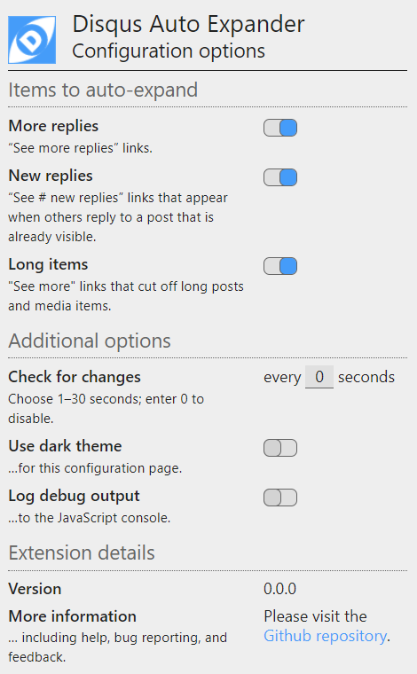
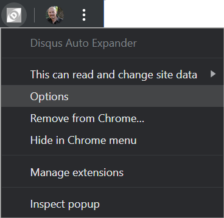
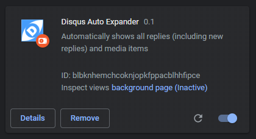
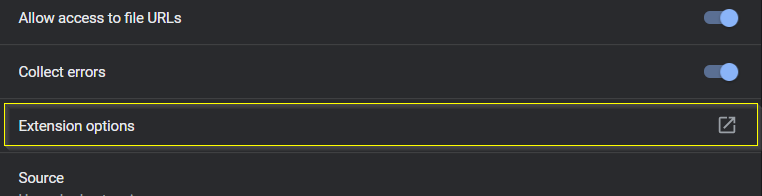
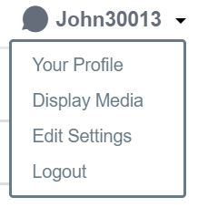

# Disqus Auto Expand
Disqus Auto Expand is a browser extensions for Chrome and Firefox that automatically expands collapsed replies and long posts and media items in Disqus discussions. The latest version is 0.1 (beta).

Currently, only the Chrome version is available (it should work on most Chromium- and webkit-based browsers, although probably not Safari). The Firefox version is coming soon.

-----
## Installation
_**NOTE:** The Chrome and Firefox extensions are now available in their respective app stores._

### Chrome desktop browser
[Install from the Google Play Store](https://chrome.google.com/webstore/detail/disqus-auto-expander/fpbfgpbppogiblppnplbkkcdmnklnbao?hl=en&gl=US).

### Chrome-based mobile browsers for Android
Chrome for Android does not currently support installing extensions. However, other mobile browsers based on the Chromium browser engine, such as Kiwi and Yandex, do support extensions.

- [Read instructions for the Kiwi browser](https://www.howtogeek.com/415876/how-to-install-desktop-chrome-extensions-on-android/)
- [Read instructions for the Yandex browser](https://www.gizbot.com/how-to/tips-tricks/how-you-can-install-chrome-extensions-on-android-050121.html).

After you install one of those browsers, [install the extension from the Google Play Store](https://chrome.google.com/webstore/detail/disqus-auto-expander/fpbfgpbppogiblppnplbkkcdmnklnbao?hl=en&gl=US).

### Firefox desktop and mobile browsers
[Install from the Firefox Add-ons site](https://addons.mozilla.org/en-US/firefox/addon/disqus-auto-expander/?src=search).

### Other browsers
I have not tried to install the extension on any other browsers (e.g., MS Edge, Opera, Safari, etc.). I don't have access to an iOS device, so I can't do the development work necessary to make it work on Safari [see note below]. I can try MS Edge and Opera—especially since MS Edge is going to adopt the WebKit browser engine (the same engine that powers Chrome and Safari), albeit with some Microsoft-specific customizations.

I will update this section when I have more to share.

_**Note:** if you are a web developer with an iOS machine and would like to help adapt this extension for Safar, please contact me. The code is open source, but I would like to collaborate, especially as I'm planning to add more features in the future.

-----

## Configuration and operation
The extension is designed to work automatically, and it is configured with the most useful options (i.e., expand all replies and long media items; and check for new links every 5 seconds).

You can change the configuration to choose (a) which links to automatically expand, and (b) how often to check for new links. There are three ways to access the configuration screen:
1. On a desktop browser, when you are on a web page that contains a Disqus discussion area, the extension’s icon turns blue: . You can click the icon to display the configuration page in a popup view:  
  
_**Note:** you may need to scroll down to see all of the options in the popup view._

1. On a Desktop browser, when you are on a web page that _does not_ contain a Disqus discussion area, the extension’s icon turns gray: . You can click the icon to display the extension management popup and choose “Options”:  

1. On a Desktop or Mobile browser you can access the “Extension options” page by choosing the “Details” button on the extension’s tile in the browser’s “Extensions” page:  
  
Then on the details page scroll down and select the section titled “Extension options”:  

Either of the last two options will display a new browser tab or window containing the extension’s configuration page, which is identical to the popup shown in the first option above.

On the configuration popup or page you can change any of the options shown. Changes take effect immediately (there is no “Save” button) and—if you are signed in to your browser’s synchronization service—will be synchronized to your other browsers.

### Configuration help
Click the Disqus Auto-Expander icon ( or ) to display the Configuration options page. When the icon is blue, the Options page appears as a popup window. Note that you might have to scroll down to see all of the options.

When the icon is gray, the browser’s Extension management menu appears instead. Choose the “Options” item to display the Configuration options page in a new browser tab or window. The sections below provide more information about these configuration options.

Note that your changes on the Configuration options page are saved automatically. And if you use your browser’s synchronization feature, your settings will be synchronized to your other browsers.

#### Items to auto-expand
These are the links Disqus displays when a comment has more than 6 replies (“More replies”), or when another user submits a reply while you are viewing the comment (“New replies”). Enabling these options will expand these links as they come into view.

**Note:** when one of these links is expanded, it may expose more links. Those links will be expanded as you scroll them into view.

#### Long items and hidden media
These are links Disqus displays when a comment or media item is very long (“Long items”), or when a user has uploaded an image or included the URL of a media item such as a Tweet or video (“Hidden media items”). Enabling these options will expand these links as they come into view.

By default, on mobile devices Disqus hides media items, and shows them by default on other devices. When the Disqus menu shows “Display Media” that means it is currently in “Hide Media” mode:  
  
Choosing that option in the Disqus menu will cause Disqus to display all media items as the discussion content loads, and the option will change to “Hide Media”. If you choose that option, you do not need to use the “Hidden media items” option in this extension.

**Important notes:** If you enable the “Hidden media items” option in this extension, you will likely use more data, since all embedded media will be downloaded automatically.

Also, if an embedded audio or video player is revealed, it might play automatically. Such behavior is controlled by your browser, not this extension. The following resources can help you manage autoplay in your browser, 
- [How to Disable Autoplay Videos on Sites in Google Chrome](https://www.groovypost.com/howto/disable-autoplay-videos-on-sites-in-google-chrome/)
- [Stop videos from automatically playing with new autoplay controls from Firefox](https://blog.mozilla.org/firefox/block-autoplay/)

Even after following these instructions, the browser may still allow some media to autoplay (this seems to depend on whether you have previously interacted with the source of that media). This extension tries to prevent autoplay media embedded by Disqus, regardless of the autoplay settings in your browser.

#### Additional options
These options control other aspects of the extension.
- “Check for changes” controls how often (in seconds) the extension checks for new links.
- “Use dark theme” changes the options page to a dark color theme.
- “Log debug output” causes the extension to log debug messages to the brower’s Developer Console. You should not need to enable this option during normal usage.

-----

## Future changes
I welcome your suggestions for new features. I am currently considering the following:

- Add a push button that would completely load a discussion and expand all of its replies and embedded media. The purpose is to allow searching the full text of the discussion (especially an older one that is no longer receiving new comments). Since this feature could potentially load a lot of data, it wouldn’t be a “persistent” option like the link expansion options are; it would be “on demand”.
