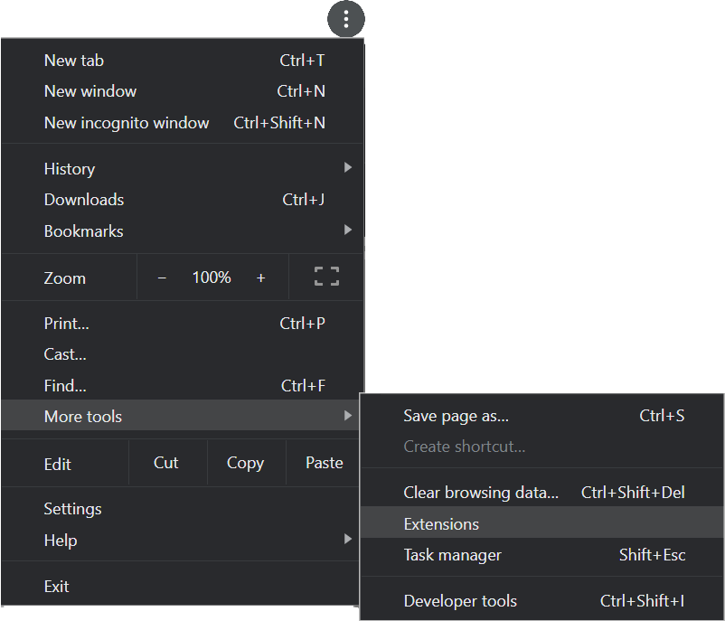

# Disqus Auto Expand
Disqus Auto Expand is a browser extensions for Chrome and Firefox that automatically expands collapsed replies and long posts and media items in Disqus discussions. The latest version is 0.1 (beta).

Currently, only the Chrome version is available (it should work on most Chromium- and webkit-based browsers, although probably not Safari). The Firefox version is coming soon.

## Installation
Before following any of the instructions below, you should first clone or download and unzip this repository to your desktop or laptop computer. (You could also try downloading it to your mobile device if you plan to install it there; see below for details.) In the instructions below, you can choose to install from either the `src/` or `dist/` directory: 
- `src/<platform>` contains all the uncompressed source code files, including the Sass stylesheet (`.scss`) and `.css.map` files.
- `dist/<platform>` contains compressed `.js`, `.css` and `.html` files, and omits any “development” files that aren’t strictly needed by the extension.
- `dist/packed/Chrome` contains the “packed” extension files (`.crx` for Chrome; TBD for Firefox), which are what would be installed from the Google Play Store or Firefox Addons site. See below for more details.  
*__Note:__ I will publish this extension to the Google Play Store and Firefox Addons site once each platform’s version is out of beta testing.*

### Chrome desktop browser
1. Open your Chrome browser.
1. Either browse to [“chrome://extensions”](chrome://extensions) or open the “Customize and control Google Chrome” menu (three vertical dots) › “More tools” › “Extensions”:  

1. Enable "Developer mode" using the toggle at the top right of the Extensions page:  
.  
This will display three new buttons below the “Extensions” menu at the top left of the page:  
.
1. Select the "Load unpacked" button, then browse to either the `src/Chrome` or `dist/Chrome` directory in your local copy of the repository, and choose the “Select folder” button. The “Disqus Auto Expand” extension will then appear on the Extensions page:  
  
*__Note:__ although you can __install__ the packed extension (`.crx` file) in Developer mode, Chrome will not allow you to __enable__ it due to security restrictions. Only packed extensions installed from the Google Play Store can be enabled in the browser.*
1. Close the “Extensions” browser tab.  
*__Note:__ each time you restart Chrome, it will warn you about running extensions in Developer mode and prompt you to disable them. Click the “x” in the warning popup to close it; the extension will continue to operate.*

### Chrome-based browsers for Android
Chrome for Android does not currently support installing extensions. However, other mobile browsers based on the Chromium browser engine, such as Kiwi and Yandex, do allow you to install extensions.

- [Read instructions for the Kiwi browser](https://www.howtogeek.com/415876/how-to-install-desktop-chrome-extensions-on-android/). Kiwi has a Developer mode just like Chrome desktop that allows you to install extensions from a local `.crx` or `.zip` file. To install this extension:
    1. Install the Kiwi browser on your Android device.
    1. In your copy of this repository, navigate to `dist/packed/Chrome`.
    1. Copy the `Disqus Auto Expand.crx` file to your Android device (using a USB cable or other file transfer method of your choice).
    1. On your Android device, launch the Kiwi browser.
    1. The rest of the installation steps are similar to Chrome desktop, except that the “Extensions” menu item is in the main menu (there is no “More tools” sub-menu). Also, the Kiwi browser does not warn about running Developer mode extensions every time you restart it.

- [Read instructions for the Yandex browser](https://www.gizbot.com/how-to/tips-tricks/how-you-can-install-chrome-extensions-on-android-050121.html).  
*__Note:__ Yandex currently only supports installing extensions from the Google Play Store. I will deploy this extension to the Google Play Store once it has passed beta testing.*

### Firefox desktop browser
_Coming soon!_

### Firefox for Android
_Coming soon!_

## Configuration and operation
The extension is designed to work automatically, and it is configured with the most useful options (i.e., expand all replies and long media items; and check for new links every 5 seconds).

You can change the configuration to choose (a) which links to automatically expand, and (b) how often to check for new links. There are three ways to access the configuration screen:
1. On a desktop browser, when you are on a web page that contains a Disqus discussion area, the extension’s icon turns blue: . You can click the icon to display the configuration page in a popup view:  
  
_**Note:** you may need to scroll down to see all of the options in the popup view._

1. On a Desktop browser, when you are on a web page that _does not_ contain a Disqus discussion area, the extension’s icon turns gray: . You can click the icon to display the extension management popup and choose “Options”:  

1. On a Desktop or Mobile browser you can access the “Extension options” page by choosing the “Details” button on the extension’s tile in the browser’s “Extensions” page:  
  
Then on the details page scroll down and select the section titled “Extension options”:  

Either of the last two options will display a new browser tab or window containing the extension’s configuration page, which is identical to the popup shown in the first option above.

On the configuration popup or page you can change any of the options shown. Changes take effect immediately (there is no “Save” button) and—if you are signed in to your browser’s synchronization service—will be synchronized to your other browsers.
