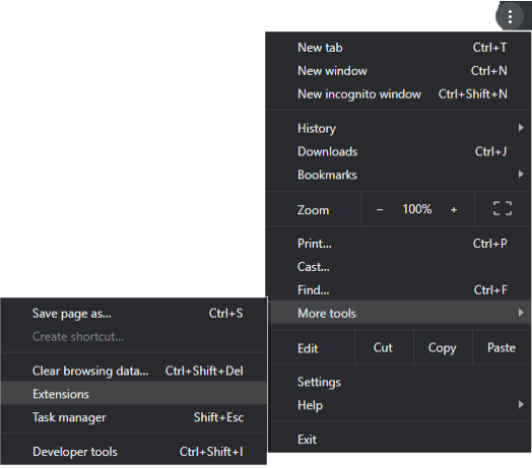
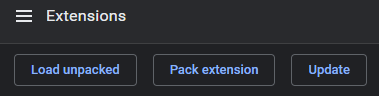

# disqus-auto-expand
Browser extensions for Chrome and FF to automatically expand “show more” and “see more” links in Disqus discussions. The latest version is 0.1 (beta). I have tested it myself on a couple of sites that use Disqus and it seems to work as designed.

Currently, only the Chrome version is available (it should work on most webkit-based browsers, though probably not Safari). The Firefox version is coming soon.

## Installation
In all cases below, you should first clone or download and unzip this repository to your local machine. In the instructions below, you can choose to install from either the `src/` or `dist/` directory. 
- `src/<platform>` contains all the uncompressed source files, including the Sass stylesheet and .css.map file.
- `dist/` contains compressed files and omits any files that aren't strictly needed by the extension.

### Chrome desktop browser
1. Open your Chrome browser.
1. Either browse to [“chrome://extensions”](chrome://extensions) or open the “Customize and control Google Chrome” menu (three vertical dots) › “More tools” › “Extensions”:  

1. Enable "Developer mode" using the toggle at the top right of the Extensions page: . This will display three new buttons below the “Extensions” menu at the top left of the page: .
1. Select the "Load unpacked" button, then browse to either the `src/Chrome` or `dist/Chrome` directory and choose the “Select folder” button. The “Disqus Auto Expand” extension will appear on the Extensions page.  

1. Close the Extensions browser tab. The extension is now installed.

### Chrome-based browsers for Android
Chrome for Android does not currently support installing extensions. However, other mobile browsers based on the Chromium browser engine, such as Kiwi and Yandex, do allow you to install extensions.

- [Instructions for the Kiwi browser](https://www.howtogeek.com/415876/how-to-install-desktop-chrome-extensions-on-android/). Note that Kiwi has a Developer mode that allows you to install extensions from a local `.crx` or `.zip` file. 
    1. In your local copy of the repository, navigate to `dist/packed/Chrome`.
    1. Copy the `Disqus Auto Expand.crx` file to your Android device (using a USB cable or other file transfer method of your choice).
    1. On your Android device, launch the Kiwi browser.
    1. The rest of the installation instructions are similar to the Chrome Desktop instructions, except that the “Extensions” menu item is in the main settings menu, not in a “Tools” sub-menu.

- [Instructions for the Yandex browser](https://www.gizbot.com/how-to/tips-tricks/how-you-can-install-chrome-extensions-on-android-050121.html). Note that Yandex only supports installing extensions from the Google Play Store. I plan to deploy this extension to the Google Play Store once it is out of beta test.

### Firefox desktop browser
Coming soon!

### Firefox for Android
Coming soon!

## Configuration and operation
Coming soon!