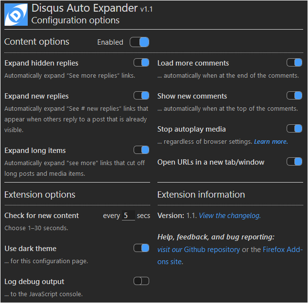

# Disqus Auto Expander

Disqus Auto Expander is a browser extensions for Chrome and Firefox that automatically expands collapsed replies and long posts and media items in Disqus discussions. The latest version is 1.1.3.1 (see the [changelog](#changelog)).

---

## Installation

### Chrome desktop browser

[Install from the Google Play Store.](https://chrome.google.com/webstore/detail/disqus-auto-expander/fpbfgpbppogiblppnplbkkcdmnklnbao?hl=en&gl=US)

### Chrome-based mobile browsers for Android

Chrome for Android does not currently support installing extensions. However, other mobile browsers based on the Chromium browser engine, such as Kiwi and Yandex, do support extensions.

- [Read instructions for the Kiwi browser.](https://www.howtogeek.com/415876/how-to-install-desktop-chrome-extensions-on-android/)
- [Read instructions for the Yandex browser.](https://www.gizbot.com/how-to/tips-tricks/how-you-can-install-chrome-extensions-on-android-050121.html)

After you install one of those browsers, [install the extension from the Google Play Store](https://chrome.google.com/webstore/detail/disqus-auto-expander/fpbfgpbppogiblppnplbkkcdmnklnbao?hl=en&gl=US).

### Firefox desktop and mobile browsers

[Install from the Firefox Add-ons site.](https://addons.mozilla.org/en-US/firefox/addon/disqus-auto-expander/?src=search)

### Other browsers

I have not tried to install the extension on any other browsers (MS Edge, Opera, Safari, etc.). I don’t have access to an iOS device, so I can’t do the development work necessary to make it work on Safari (see note below). I can try MS Edge and Opera—especially since MS Edge is going to adopt the WebKit browser engine (the same engine that powers Chrome and Safari), albeit with some Microsoft-specific customizations.

I will update this section when I have more to share.

_**Note:** if you are a web developer with an iOS machine, and you are willing to help adapt this extension for Safari, please contact me. The code is open source, but I would like to collaborate with you._

---

## Configuration and operation

The extension is designed to work automatically, and it is configured with the most useful options (i.e., expand all replies and long media items; load new comments and more comments, and check for new links every 5 seconds).

You can change the configuration to choose which items to automatically expand, and how often to check for new links. There are three ways to access the configuration screen:

1. On a desktop browser, when you are on a web page that contains a Disqus discussion, the extension’s icon turns blue: . You can click the icon to display the configuration page as a popup:  
     
   _**Note:** you may need to scroll down to see all of the options in the popup view._

1. On a desktop browser, when you are on a web page that _does not_ contain a Disqus discussion area, the extension’s icon turns gray: . You can click the icon to display the extension management popup and choose “Options”:  
   

1. On a desktop or mobile browser you can access the “Extension options” page by choosing the “Details” button on the extension’s tile in the browser’s “Extensions” page:  
     
   Then on the details page scroll down and select the section titled “Extension options”:  
   

Either of the last two options will display a new browser tab or window containing the extension’s configuration page, which is identical to the popup shown in the first option above.

On the configuration popup or page you can change any of the options shown. Changes take effect immediately (there is no “Save” button) and—if you are signed in to your browser’s synchronization service—will be synchronized to your other browsers.

### Configuration options

Click the Disqus Auto-Expander icon ( or ) to display the Configuration options page.

When the icon is blue, the active tab or window contains a Disqus discussion. The Options page appears as a popup when the icon is clicked. Note that you might have to scroll down to see all of the options in the popup.

When the icon is gray, the active tab or window does not contain a Disqus discussion. The browser’s Extension management menu appears when the icon is clicked. Choose the “Options” menu item to display the Configuration options page in a new browser tab or window.

The sections below provide more information about these configuration options.

_**Note:** your changes on the Configuration options page are saved automatically. And if you use your browser’s synchronization feature, your settings will be synchronized to your other browsers._

#### Enabled

This option controls whether the extension runs on web pages with Disqus discussions. When this option is turned off, the extension pauses its search for new links to expand, the other Configuraton option toggles become disabled, and the extension’s icon changes to a “paused” image: .

_**Notes**:_

_1. This button is only available from the popup version of the options page, since it applies to the currently active tab or window that contains a Disqus discussion._

_2. The button is disabled when the active tab or window does not contain a Disqus discussion (including on the Extensions page)._

Since this option could load a lot of data (and media, if you have [Display Media mode enabled](#a-note-about-hidden-media-items)), this is not a persistent option. Instead, you can use this button to load all of the content on demand. When you click this button you will be prompted to confirm that you want to proceed.

#### Expand hidden/new replies

These are the links Disqus displays when a comment has more than 6 replies (“More replies”), or when another user submits a reply while you are viewing the comment (“New replies”). Enabling these options will expand these links as they come into view.

**Note:** when one of these links is expanded, it may expose more links. Those links will be expanded as you scroll them into view.

#### Expand long items

Disqus displays a “See more” link at the bottom of a comment or media item that it considers too long. This option automatically shows the full item when it comes into view.

#### A note about hidden media items

By default, Disqus hides embedded media items (such as images, Tweets and videos) on “mobile” devices, and shows them on “desktop” devices. When the Disqus menu shows “Display Media”, that means it is _currently_ hiding embedded media:  
  
Choosing that option in the menu will cause Disqus to display all media items as the discussion content loads, and the option’s title will change to “Hide Media”. Since Disqus allows you to control this option itself, the extension does not have an option to automatically expand hidden media items.

#### Show more/new comments

These are the buttons at the bottom and top of the discussion that let you load more comments (if there are more comments than Disqus wants to load at one time) and load new comments that have arrived since you started reading the discussion. As with the collapsed replies links, these will be activated automatically when they come into view.

#### Stop autoplay media

When an embedded audio or video player is revealed, it might play automatically. This behavior is controlled by your browser. The following resources can help you manage autoplay in your browser:

- [How to Disable Autoplay Videos on Sites in Google Chrome](https://www.groovypost.com/howto/disable-autoplay-videos-on-sites-in-google-chrome/)
- [Stop videos from automatically playing with new autoplay controls from Firefox](https://blog.mozilla.org/firefox/block-autoplay/)

However, even after following these instructions, the browser may still allow some media to autoplay (this seems to depend on whether you have previously interacted with the source of that media). This feature tries to prevent autoplay media embedded by Disqus, regardless of the autoplay settings in your browser.

#### Open URLs in a new tab/window

When you click on an embedded media item (image, Tweet, video), the item opens in a new browser tab or window (depending on your browser’s settings). URLs entered in comments and replies are also clickable, but they load in the _current_ window, replacing the page you are viewing. This feature forces those URLs to open in a new browser tab or window.

#### Extension options

These options control other aspects of the extension.

- **Check for changes**: controls how often (in seconds) the extension checks for new links.

- **Use dark theme**: displays the options page in a dark color scheme:
  

- **Log debug output**: causes the extension to log debug messages to the brower’s Developer Console. You should not need to enable this option during normal usage.

## Load entire discussion

Unlike the other options, this button appears on the web page itself, at the top of the discussion area just above the "Join the discussion" entry field, whenever there is some hidden discussion content.

Click this button to automatically expand all content and reply links until all of the discussion content is loaded. This feature is most useful for discussions that are not receiving new comments or replies. The goal is to allow searching the full content of the discussion using your browser’s “Find...” (Ctrl+F) command.

_**Note:** this feature can take some time to run and use a lot of data and memory, especially for long discussions. A warning about this appears the first time you select this option on a long discussion (more than 500 comments)._

---

## Reporting bugs

If you encounter a bug, please create an Issue in this repository. Be sure include the following information:

- The URL of the page where the error happened.
- The issue you experienced (describe in as much detail as possible).
- If you can reproduce the problem, provide the steps to do so.
- Which browser (including version) you are using.
- Which version of the extension you are using (the version is shown on the Configuration options page).
- Any other information you think would be helpful.

---

## Changelog

## Version 1.1.3.1 (Chrome only)

Bug fixes.

### Version 1.1.3 (Chrome only)

Allows the extension to work correctly with Disqus' new visual design (which broke the "Load more comments" auto-expanding function). Also migrates to version 3 of the the browser extension manifest format, which is required for extensions to be supported in Chrome after January 1, 2023.

### Version 1.1.2

Adds left and right margins on small screens to make it easier to tap the up-vote link, and generally easier to read.

### Version 1.1.1

Bug fix for the Firefox add-on.

### Version 1.1

- The **Load entire discussion** button now appears on the main web page to make the feature available on mobile browsers.
- New **Enabled** option on the Configuration page to control whether the extension operates on the current page. Such control was previously possible by setting the “Check for new content” option to 0 (zero). With the new “Enabled” option, 0 is no longer an allowed value for “Check for new content”.
- Content processing pauses when an open reply field is visible on the page. This is to prevent links above the reply field from expanding and pushing the reply field down (or possibly off the end of) the browser windown. Processing resumes when the reply field is closed or scrolled off the screen.
- Various bug fixes and improvements in functionality.

### Version 1.0

- New **Load all content** option: automatically expands all replies and content links and buttons until all content has been loaded.
- The extension’s icon in the browser’s toolbar changes to a “pause” icon when the “Check for new content” option is set to 0 (zero).

### Version 0.3

New auto-expand options:

- **Load more comments**: expands the “Load more comments” button when at the end of the discussion.
- **See new comments**: expands the “See # new comments” button when at the top of the discussion.

Bug fixes:

- Fixed the **Open URLs in a new tab/window** option.

### Version 0.2

New content management options:

- **Stop autoplay media**: attemtps to stop autoplay embedded audio and video items (because the browser settings to do this do not always work). Does not affect GIFs.
- **Open links in a new tab or window**: forces URLs included in a comment to open in a new browser window or tab (depending on your browser’s settings).

### Version 0.1

Initial release. Provides the following features to make reading Disqus forums more enjoyable.

Automatically expands the following collapsed items:

- **See more replies**
- **See # new replies**
- **See more** (link that cuts off the bottom of long comments and embedded media items)

Click the extension’s icon in the browser's toolbar to control each option. You can also configure the following:

- **Check for new content**: how often (in seconds) the extension checks for new links to expand.
- **Use dark theme**: display the configuration page in a dark color theme.
- **Log debug output**: logs messages about the extension’s operation to the browser’s developer console. You should not need to enable this option unless you are experiencing problems with the extension. (This option will be removed in a future release.)

---

## Credits

Warning icon made by [Amit Jakhu](https://www.flaticon.com/authors/amit-jakhu) from [www.flaticon.com](https://www.flaticon.com/) is licensed by [Creative Commons BY 3.0](http://creativecommons.org/licenses/by/3.0/).
