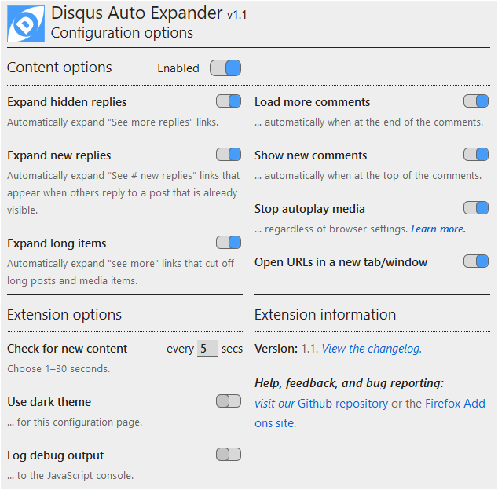

# Disqus Auto Expand
Disqus Auto Expand is a browser extensions for Chrome and Firefox that automatically expands collapsed replies and long posts and media items in Disqus discussions. The latest version is 0.1 (beta).

Currently, only the Chrome version is available (it should work on most Chromium- and webkit-based browsers, although probably not Safari). The Firefox version is coming soon.

## Installation
_**NOTE:** The Chrome and Firefox extensions are now available in their respective app stores._

### Chrome desktop browser
[Install from the Google Play Store](https://chrome.google.com/webstore/detail/disqus-auto-expander/fpbfgpbppogiblppnplbkkcdmnklnbao?hl=en&gl=US).

### Chrome-based mobile browsers for Android
Chrome for Android does not currently support installing extensions. However, other mobile browsers based on the Chromium browser engine, such as Kiwi and Yandex, do support extensions.

- [Read instructions for the Kiwi browser](https://www.howtogeek.com/415876/how-to-install-desktop-chrome-extensions-on-android/)
- [Read instructions for the Yandex browser](https://www.gizbot.com/how-to/tips-tricks/how-you-can-install-chrome-extensions-on-android-050121.html).

After you install one of those browsers, [install the extension from the Google Play Store](https://chrome.google.com/webstore/detail/disqus-auto-expander/fpbfgpbppogiblppnplbkkcdmnklnbao?hl=en&gl=US).

### Firefox desktop and mobile browsers
[Install from the Firefox Add-ons site](https://addons.mozilla.org/en-US/firefox/addon/disqus-auto-expander/?src=search).

### Other browsers
I have not tried to install the extension on any other browsers (e.g., MS Edge, Opera, Safari, etc.). I don't have access to an iOS device, so I can't do the development work necessary to make it work on Safari [see note below]. I can try MS Edge and Opera—especially since MS Edge is going to adopt the WebKit browser engine (the same engine that powers Chrome and Safari), albeit with some Microsoft-specific customizations.

I will update this section when I have more to share.

_**Note:** if you are a web developer with an iOS machine and would like to help adapt this extension for Safar, please contact me. The code is open source, but I would like to collaborate, especially as I'm planning to add more features in the future.

## Configuration and operation
The extension is designed to work automatically, and it is configured with the most useful options (i.e., expand all replies and long media items; and check for new links every 5 seconds).

You can change the configuration to choose (a) which links to automatically expand, and (b) how often to check for new links. There are three ways to access the configuration screen:
1. On a desktop browser, when you are on a web page that contains a Disqus discussion area, the extension’s icon turns blue: . You can click the icon to display the configuration page in a popup view:  
  
_**Note:** you may need to scroll down to see all of the options in the popup view._

1. On a Desktop browser, when you are on a web page that _does not_ contain a Disqus discussion area, the extension’s icon turns gray: . You can click the icon to display the extension management popup and choose “Options”:  

1. On a Desktop or Mobile browser you can access the “Extension options” page by choosing the “Details” button on the extension’s tile in the browser’s “Extensions” page:  
  
Then on the details page scroll down and select the section titled “Extension options”:  

Either of the last two options will display a new browser tab or window containing the extension’s configuration page, which is identical to the popup shown in the first option above.

On the configuration popup or page you can change any of the options shown. Changes take effect immediately (there is no “Save” button) and—if you are signed in to your browser’s synchronization service—will be synchronized to your other browsers.

## Future changes
I welcome your suggestions for new features. I am currently considering the following:

- Better handling of embedded media items. Currently, if you have the “Display Media” option selected—  
  
—which seems to be the default setting on desktop browsers, the discussion thread can “jerk” when a new media item is added above the current viewport (the part of the web page that is currently visible in the browser window). This jerking behavior can be prevented by choosing the “Hide Media” option (click on “Display Media” to toggle it to “Hide Media”):  
  
When this setting is active (which seems to be the default for mobile devices), all embedded menu items are shown as links, and you have to click each link to display its media item. Expanding those links automatically when they enter the viewport should be no harder than expanding the reply links.

- A push button that would completely load a discussion and expand all of its replies and media. The purpose is to allow searching the full text of the discussion (especially and older one that is no longer receiving new comments). Since this feature could potentially load a lot of data, it wouldn’t be a “persistent” option like the link expansion options are; it would be “on demand”.
